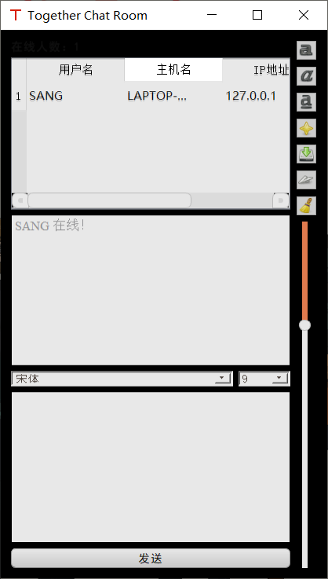
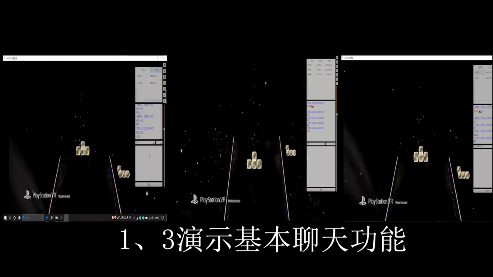

## 介绍

​	一款基于QtAV(基于Qt和FFmpeg的多媒体库)和Qt开发环境的，多人实时共享观看本地视频、聊天、传输文件的项目。

	+ 当做一个播放器，用于播放本地文件
	+ 共享一个本地视频，传到rtmp服务器上，和其他人实时共享（其他人只需要输入服务器地址，就可以拉取实时视频流）
	+ 和观看的人一起聊天、传输文件（目前这个功能只实现了局域网）

​	共享本地视频需要提供rtmp流服务器地址，关于rtmp流服务器的搭建可自行百度，当时用的阿里云学生套餐，在Ubuntu搭建了nginx的rtmp流媒体服务器，测试软件顺利。

## 环境支持

1. Qt 5.13.1及以上版本
2. QtAV [QtAV](https://github.com/wang-bin/QtAV)

## 运行

​	上面直接传了可执行文件，如果想直接看效果，运行可执行文件。

​	如果环境搭好了，打开源码进行构建应该也是可以运行的。

## 效果

	

